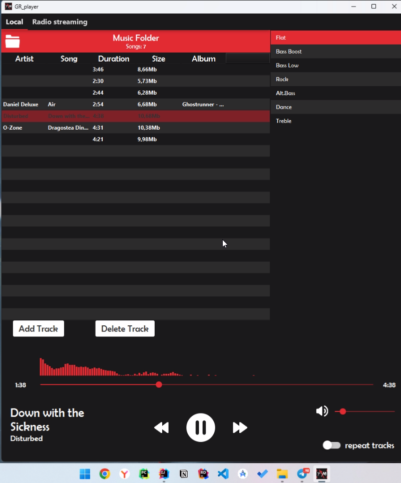

# grPlayer

My humble music player with artisanal design inspired by ghostunner OST cover style
Rework of ktualhu's project https://github.com/ktualhu/ktPlayer-Music-Player

coded in Java 22 with using JavaFx.

The following libraries were using:
  - mp3agic
  - jfoenix

How to run in IDE:
  - open cmd and cd to the project
  - type "mvn clean javafx:run" (download javaFX to run without maven)
  - due to build bug, building jar is not yet supported

  
How to use:
  - use top left button to load a playlist or add tracks manually by the respective button 
  - 2x speed up is supported by holding the 'next track button'
  - apply equalizer presets if wanted
  - switch to music streaming

Player UI:

 

